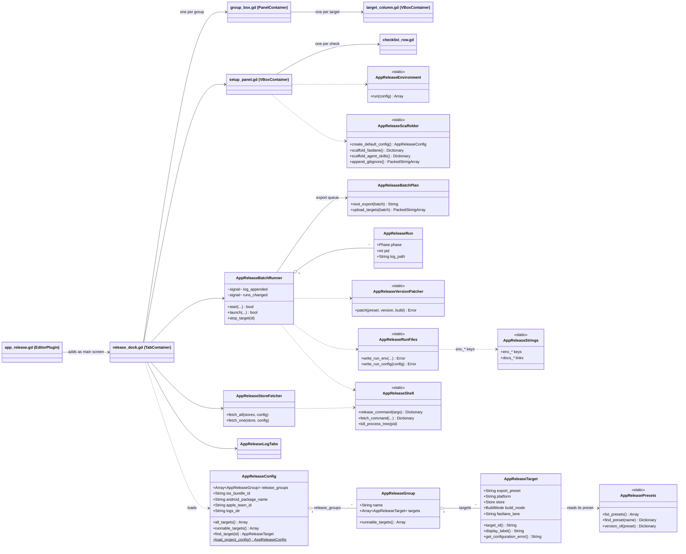
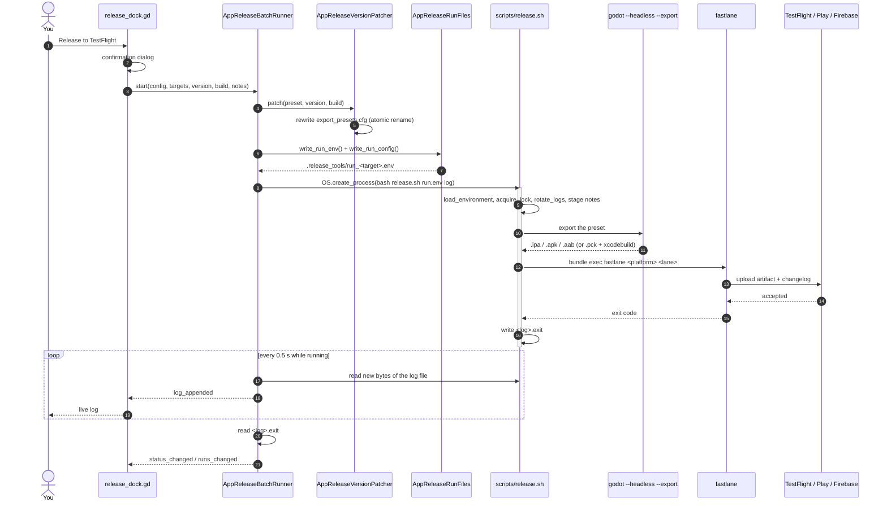
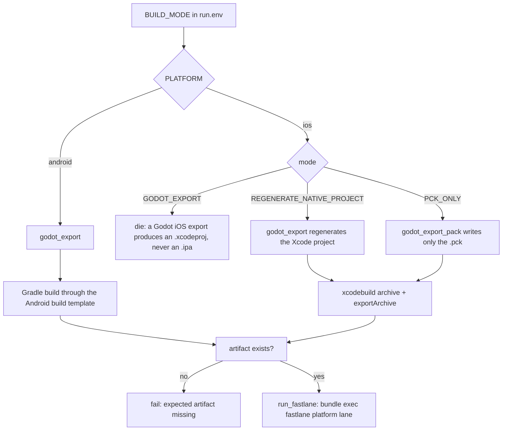

# Architecture

How App Release is put together, for people working **on** the plugin. If you only want to
ship an app, the [README](README.md) and the [store guides](docs/) are enough.

## The one-paragraph version

The plugin is a thin editor UI over a shell script. Everything configurable lives in a Godot
resource (`release_config.tres`). Because bash and Ruby cannot read a `.tres`, the plugin
**flattens** the resolved settings for one run into `.release_tools/run_<target>.env` and
hands that file to `scripts/release.sh`, which exports the project with a headless Godot and
uploads the artifact with fastlane. The panel never talks to a store itself — it starts
processes and tails their log files.

```
release_config.tres  →  run.env  →  release.sh  →  godot --export / xcodebuild  →  fastlane  →  store
      (GDScript)        (plain KEY="value")            (bash)                       (Ruby)
```

## Layers

| Layer | Directory | Knows about |
|---|---|---|
| Config | `addons/app_release/config/` | Resources you edit in the Inspector |
| Core | `addons/app_release/core/` | Files, processes, the OS. No UI |
| UI | `addons/app_release/ui/` | The Release and Setup tabs. Owns no logic worth testing twice |
| Strings | `addons/app_release/constants/` | Every user-facing string and every path literal |
| Scripts | `addons/app_release/scripts/` | bash, PowerShell, Ruby, and the headless CI entry point |
| Templates | `addons/app_release/templates/` | Seed copies of `Gemfile`, `fastlane/*` and the `.agents/` skills, copied into the host project once |

## Classes



`AppReleaseStrings` is used by nearly everything; only the edges that matter for the
`run.env` contract are drawn.

## One release, start to finish



There is no pipe between the editor and the script. The script owns its log file, and the
exit code arrives as a separate `.exit` sidecar — which is why the runner waits a few polls
after the process disappears before calling a run statusless.

**Batches.** Releasing a whole group runs every export one after another (they share one
exporter and one `export_presets.cfg`), then starts all uploads at once.
`AppReleaseBatchPlan` holds that queue; each process is one `AppReleaseRun` with
`Phase.EXPORT` or `Phase.UPLOAD`.

## Which build mode does what



Mirrors `export_project()` in [`scripts/release.sh`](addons/app_release/scripts/release.sh).
`PCK_ONLY` is the mode to use once you maintain the Xcode project by hand — capabilities,
entitlements, extra frameworks — because a full export overwrites it.

## The GDScript ↔ shell contract

This is the one place where a change has to be made in three files at once:

| File | Role |
|---|---|
| `constants/release_strings.gd` | `env_*` constants — the key names |
| `core/run_files.gd` | writes those keys into `run.env` |
| `scripts/release.sh` / `scripts/release.ps1` | `require_var` / read them back |

Adding a target field means: an `@export` on `AppReleaseTarget`, a visibility rule in
`_validate_property()`, a check in `get_configuration_error()`, an `env_*` constant, a line
in `write_run_env()`, a reader in **both** scripts, and a `tests/shell` case.

## Generated and scratch files

| Path | Written by | Committed |
|---|---|---|
| `release_config.tres` | Setup tab, then you | yes |
| `Gemfile`, `fastlane/{Fastfile,Appfile,Pluginfile}` | Setup tab, then yours to edit | yes |
| `.agents/README.md`, `.agents/skills/*.md` | Setup tab (optional), then yours to edit | yes |
| `fastlane/.env` | Setup tab (placeholders) | **no** — credentials |
| `.release_tools/run_<target>.env`, `config.json`, `releases_*.json` | the plugin, per run | no |
| `logs/release_*.log` + `.exit` | `release.sh` | no |
| `release-notes/<version>-<build>.md` | `release.sh` | yes, if you like |
| `fastlane/metadata/android/en-US/changelogs/<build>.txt` | `release.sh` | yes |

## Tests

Three suites, one per language the logic lives in — see
[.agents/skills/run-tests.md](.agents/skills/run-tests.md).

| Language | Framework | Location |
|---|---|---|
| GDScript | GUT (vendored at `addons/gut/`) | `tests/godot/unit/` |
| Ruby | RSpec | `tests/ruby/spec/` |
| Shell | bats-core | `tests/shell/` |

Shared fixtures live in `tests/fixtures/ios_basic/`. Run everything with `tests/run_all.sh`.
