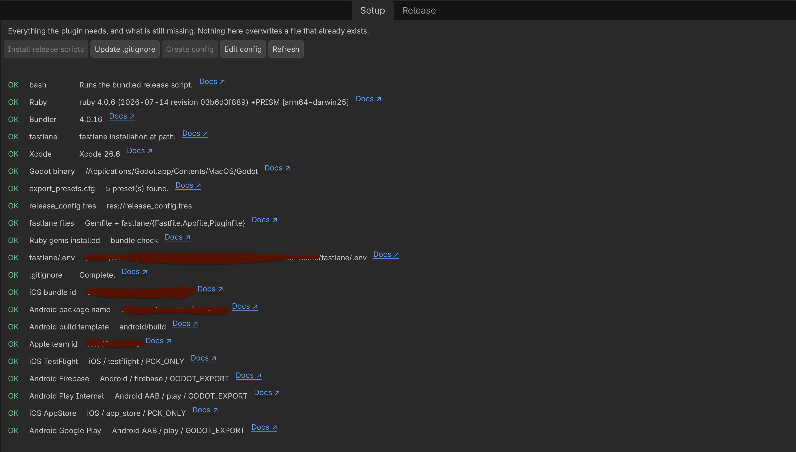
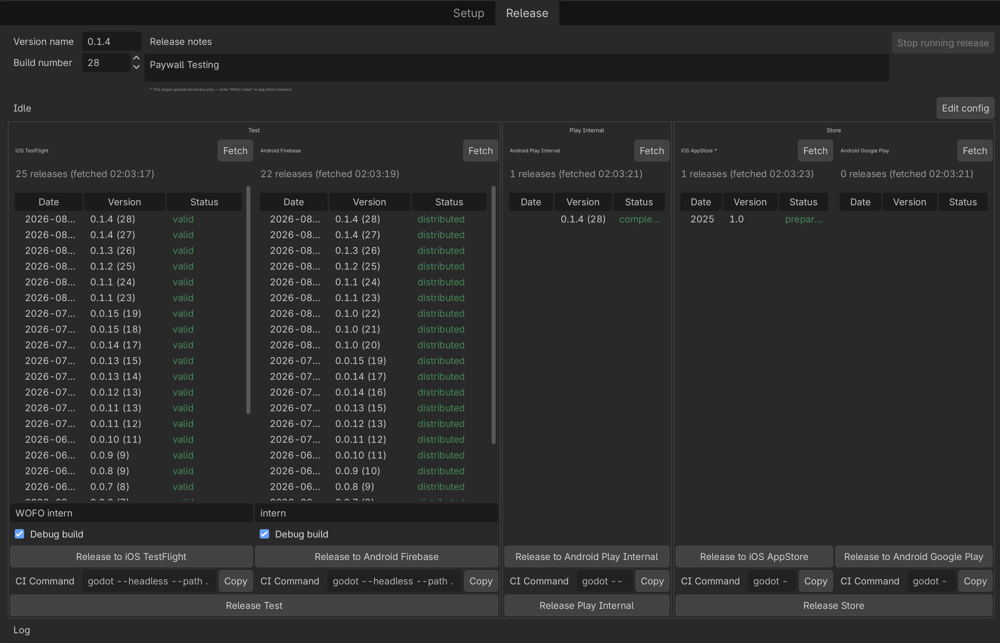

# App Release

## Overview

A Godot 4 editor plugin that exports your project for mobile and ships it — to **TestFlight**, the
**App Store**, **Firebase App Distribution** and **Google Play** — without leaving the editor.

It adds a **Release** tab next to 2D/3D/Script with one column per destination: the store's
recent releases on top, a Release button underneath, and a live build log at the bottom.
The work is mainly done by Godot's headless exporter and [fastlane](https://fastlane.tools).

Released in [Godot Asset Store](https://store.godotengine.org/asset/christoph-prenissl/app-release/)

| Setup | Release |
|---|---|
|  |  |

## Technologies

_Godot_ | _GDScript_ | _Fastlane_ | _Shell_ | _Plugin_ | _App_Store_Connect_API_ | _Firebase_App_Distribution_ | _Google_Play_API_ 

## What it does

- One click per destination: patch the version, export the preset, upload the artifact.
- **Live log** streamed from the running build, with a Stop button that kills the whole
  process tree (not just the shell).
- **Fetch** pulls the current release list from each store so you can see which build
  numbers are already taken before you upload another one.
- Release notes are written once and delivered everywhere they can be: the TestFlight
  changelog, the Firebase App Distribution release note, and the Google Play changelog.
  They are also archived to `release-notes/<version>-<build>.md`. (The App Store lane is
  the deliberate exception — see below.)
- Version name and build number are written into `export_presets.cfg`, so a manual export
  from Project → Export produces the same build.

## Requirements

| | |
|---|---|
| Godot | 4.4 or newer |
| Ruby + Bundler + fastlane | required for every target |
| Xcode | required for iOS targets — **macOS only** |
| Android build template + release keystore | required for Android targets, configured in Godot's Editor Settings |

Platform support:

| Target | macOS | Linux | Windows |
|---|---|---|---|
| TestFlight, App Store | yes | no | no |
| Firebase App Distribution, Google Play | yes | yes | best-effort¹ |

¹ Windows runs through `scripts/release.ps1`, which ships **untested** — the plugin is
developed on macOS. Bug reports welcome.

## Install

**From the Asset Library:** search for *App Release*, install, then enable it under
Project → Project Settings → Plugins.

**Manually:** copy `addons/app_release/` into your project and enable it in the same place.

## First-time setup

Open the **Release** tab and switch to **Setup**. The checklist tells you what is missing;
work down it top to bottom.

1. **Create config** — writes `res://release_config.tres` with one target per store your
   export presets can serve. It only creates targets for platforms you actually have a
   preset for.
2. **Install release scripts** — copies `Gemfile` and
   `fastlane/{Fastfile,Appfile,Pluginfile}` into your project, creates `fastlane/.env`
   with placeholder values, and runs `bundle install` for you. The gem install takes a
   few minutes and runs in the background; the button reports when it is done.

   These files are yours to edit — a plugin update will never overwrite them, and anything
   that already exists is left alone. Press the button again any time to re-run
   `bundle install`.
3. **Update .gitignore** — keeps credentials, logs and build artifacts out of git.
4. Fill in your credentials by editing `fastlane/.env`, which step 2 has already created
   for you with placeholder values.

   `fastlane/.env` is gitignored and is the only place secrets live. The plugin never
   stores or transmits them.

   | Variable | Needed for | Scope |
   |---|---|---|
   | `ASC_KEY_ID`, `ASC_ISSUER_ID`, `ASC_KEY_PATH` | TestFlight and App Store | Your whole Apple team |
   | `PLAY_JSON_KEY_PATH` | Google Play | Your whole Play developer account |
   | `FIREBASE_APP_ID_ANDROID` | Firebase App Distribution | This one app |
   | `FIREBASE_SERVICE_CREDENTIALS` | Firebase — optional, see below | Your Firebase project |

   For Firebase the plugin prefers a service-account JSON. If you leave
   `FIREBASE_SERVICE_CREDENTIALS` empty it falls back to the session cached by
   `firebase login`.

## Configure your targets

Open `release_config.tres` in the Inspector (or press **Edit config** in the Setup tab).

### App identity

Set once for the whole project, under **App identity**:

| Field | Meaning |
|---|---|
| `ios_bundle_id` | iOS bundle identifier, e.g. `com.acme.game` |
| `android_package_name` | Android package name |
| `apple_team_id` | Apple Developer team id |

These are seeded from your export presets when the config is created, so they are usually
already correct.

Identity lives here rather than on each target on purpose. The credentials in
`fastlane/.env` are **one** App Store Connect key, **one** Play service account and **one**
Firebase app id, so the setup already assumes a single iOS app and a single Android app per
project. Putting the identifier on each target would let two targets disagree while still
sharing those credentials — which fails in confusing ways rather than loudly. If you need
to ship two different bundle ids, use two Godot projects.

### Targets

**Pick the export preset first.** Everything else follows from it — the platform is read
out of the preset, and that decides which stores you can pick, how the build modes are
labelled, and which fields are shown at all.

Each target is its own resource, so you can add, duplicate and remove them freely.

| Field | Meaning |
|---|---|
| `export_preset` | Which preset from `export_presets.cfg` to export |
| `store` | Where the artifact goes. Options depend on the preset's platform |
| `build_mode` | See below |
| `fastlane_lane` | Lane invoked as `fastlane <platform> <lane>` |
| `play_track` | Google Play track — `internal`, `alpha`, `beta`, `production` |
| `artifact_path` | What gets uploaded. Blank uses the preset's own export path |
| `skip_build_processing_wait` | iOS only. Skip waiting for App Store Connect to finish processing the build after upload to TestFlight |

### Build modes

| Mode | iOS | Android |
|---|---|---|
| **Godot export** | Godot builds the `.ipa` and regenerates the Xcode project | Godot builds the APK/AAB through Gradle |
| **Regenerate native project** | Godot regenerates the Xcode project, then `xcodebuild` archives and exports it | Reinstalls the Android build template, then exports |
| **PCK only** | Exports just the `.pck`, then `xcodebuild` rebuilds your **existing, hand-maintained** `.xcodeproj` | Exports just the `.pck`, then runs `gradlew` in your existing `android/build` |

*Godot export* is the right default. Switch to **PCK only** once you have an Xcode or Gradle
project you have edited by hand — capabilities, entitlements, extra frameworks — because a
full Godot export overwrites it. Use **Regenerate native project** deliberately, after a
Godot or plugin upgrade, to pick up the new template.

## Daily use

1. Set the **version name** and **build number**. They are written into every enabled
   target's preset as soon as the field loses focus.
2. Write **release notes** — they become the TestFlight changelog, the Firebase release
   note and the Play changelog.

   The **App Store** lane is the one exception: it uploads the build only, with
   `skip_metadata: true`. Pushing metadata there would overwrite your whole App Store
   listing — description, keywords, screenshots — with whatever happens to be in the local
   `fastlane/metadata` folder, so "What's New" stays something you write in App Store
   Connect. If you keep your listing in `fastlane/metadata` and want it uploaded, drop
   `skip_metadata` from the `ios release` lane in your own `fastlane/Fastfile`.
3. Optionally add **test groups** (comma-separated aliases as defined in App Store Connect
   or Firebase) and tick **Debug build**.
4. Press **Release to …**, confirm, and watch the log.
5. Press **Fetch** on any column to reload that store's release list.

Notes, groups and the debug checkbox survive an editor restart.

## Where things end up

| Path | What |
|---|---|
| `logs/release_<target>_<timestamp>.log` | One log per run; the newest 20 are kept |
| `logs/release_*.log.exit` | The run's exit code — this is what the panel reads |
| `.release_tools/` | Generated per-run config handed to bash and Ruby. Disposable |
| `release-notes/<version>-<build>.md` | Human-readable archive, safe to commit |
| `fastlane/metadata/android/en-US/changelogs/<build>.txt` | Play changelog |

## Troubleshooting

**"another release is already running"** — a previous run left `logs/.release.lock` behind.
The script clears it by itself once the owning process is gone; delete the directory if it
persists.

**Fetch shows a red error** — the full stderr is in
`.release_tools/releases_<store>.json.err`, and the short version is in the log pane.

**"Ruby"/"Bundler"/"fastlane" missing in the Setup tab** — the editor starts child processes
with a minimal `PATH`. The plugin already probes the usual locations (Homebrew, rbenv, rvm,
asdf); add anything unusual to `extra_path_entries` in `release_config.tres`.

**Uploading to TestFlight fails on a duplicate build** — Apple rejects a build number it has
already seen. Press **Fetch** on the TestFlight column to see what is taken.

## Running it from a terminal

Everything the panel does is a shell script driven by one file. Each time you confirm a
release, the plugin writes `.release_tools/run.env` — a plain, `source`-able list of
`KEY="value"` pairs holding the whole resolved configuration for that run — and then hands
it to the script:

```sh
addons/app_release/scripts/release.sh .release_tools/run.env logs/manual.log
```

Running that yourself **repeats the last release the panel configured**. It is the quick
way to retry after fixing a credential or a lane, without going back to the editor.

Note the ordering: `run.env` is produced by the editor, so it does not exist in a fresh
checkout, and it is gitignored. A terminal run is a *re-run*, not a first run. To change
what gets built — a different target, version or build mode — set it in the panel and press
Release once, or hand-edit `run.env` before invoking the script. Note that the panel also
patches the version into `export_presets.cfg` before starting; the script does not, so a
hand-edited `VERSION` will not reach the export on its own.

## Releasing from CI

For a release triggered by a commit, `run.env` has to be generated **on the runner** — it
holds absolute paths (`PROJECT_ROOT`, `GODOT_BIN`, `EXTRA_PATH`) that mean nothing on
another machine, so a committed one would not work. `ci_release.gd` does headlessly what
pressing Release does in the editor:

```sh
godot --headless --path . \
	--script addons/app_release/scripts/ci_release.gd -- \
	--target play_internal --version 1.4.0 --build "$GITHUB_RUN_NUMBER"

bash addons/app_release/scripts/release.sh .release_tools/run.env
```

The first command resolves the target from `release_config.tres`, runs the same validation
the panel runs, patches the version into `export_presets.cfg` and writes `run.env`. The
second does the export and the upload. Both exit non-zero on failure, so the job fails
where the problem is.

Press **CI** on any target column to copy that target's exact command — with the version,
build number, tester groups and debug flag currently in the form — to your clipboard.

`--list` prints the available target ids; `--help` documents the rest.

### Credentials on a runner

**You do not need a `fastlane/.env`.** The lanes read plain environment variables, and
dotenv ignores the file when it is missing — so export your secrets directly:

```yaml
env:
  ASC_KEY_ID: ${{ secrets.ASC_KEY_ID }}
  ASC_ISSUER_ID: ${{ secrets.ASC_ISSUER_ID }}
  ASC_KEY_PATH: ${{ github.workspace }}/AuthKey.p8   # written from a secret at run time
  PLAY_JSON_KEY_PATH: ${{ github.workspace }}/play.json
  FIREBASE_APP_ID_ANDROID: ${{ secrets.FIREBASE_APP_ID_ANDROID }}
  FIREBASE_SERVICE_CREDENTIALS: ${{ github.workspace }}/firebase.json
```

The two `*_PATH` variables point at files, so decode those from base64 secrets into the
workspace before the release step, and delete them afterwards.

Commit `Gemfile`, `Gemfile.lock` and `fastlane/` so the runner can `bundle install` — only
`fastlane/.env` stays out of git.

### Android signing on a runner

Godot normally reads the release keystore from your Editor Settings, which a runner does
not have. Pass it through the environment instead:

```
GODOT_ANDROID_KEYSTORE_RELEASE_PATH      absolute path — the shell will not expand ~
GODOT_ANDROID_KEYSTORE_RELEASE_USER      key alias
GODOT_ANDROID_KEYSTORE_RELEASE_PASSWORD  key password
```

Two known traps: the path must be absolute, and setting *some but not all* of the matching
`GODOT_ANDROID_KEYSTORE_DEBUG_*` variables can break a release export
([godot#109551](https://github.com/godotengine/godot/issues/109551)) — set all of a group
or none of it.

### iOS on a runner

Needs a macOS runner with Xcode, plus signing certificates in the keychain — `fastlane
match`, or importing a `.p12` before the release step. If your target uses the **PCK only**
build mode it also needs the `.xcodeproj` committed, which many projects deliberately do
not do; **Godot export** mode avoids that.

## Security

Credentials only ever live in `fastlane/.env` and in the key files it points at, both
outside version control. The plugin does not read, store or transmit them — it hands
fastlane the environment and gets out of the way.

One detail worth knowing: when no Firebase service account is configured, the release-list
fetcher refreshes the session left by `firebase login`, using the OAuth client id and secret
of the open-source `firebase-tools` CLI. Those values are published in that project's source
— they are not secrets of yours — and you can override them with `FIREBASE_CLI_CLIENT_ID`
and `FIREBASE_CLI_CLIENT_SECRET`. Configuring `FIREBASE_SERVICE_CREDENTIALS` skips that path
entirely.

## Running the test suite

This is for people working **on** the plugin itself — none of this ships in
`addons/app_release/`, and none of it is needed to use the plugin in your own project.

The suite is split by language, matching the three places the plugin's logic actually lives:

| Language | Framework | Lives in |
|---|---|---|
| GDScript | [GUT](https://github.com/bitwes/Gut), vendored at `addons/gut/` | `tests/godot/unit/` |
| Ruby | RSpec | `tests/ruby/spec/` |
| Shell | [bats-core](https://github.com/bats-core/bats-core) | `tests/shell/` |

Shared test data — an example iOS export preset, a `run.env`, a stub `.xcodeproj`, an
`ExportOptions.plist` — lives in `tests/fixtures/ios_basic/`, used by all three suites.

**Prerequisites**, once per machine:
```sh
brew install bats-core
```
GUT is already vendored in the repo (`addons/gut/`, see `addons/gut/VENDORED_VERSION.md`) —
nothing to install. RSpec's gems install on first run via the command below.

**Run everything:**
```sh
tests/run_all.sh
```

**Run one language at a time:**
```sh
# GDScript (GUT) — first run needs an import pass, or GUT's class_names won't resolve:
godot --headless --path . --import
godot --headless --path . -s addons/gut/gut_cmdln.gd -gconfig=.gutconfig.json

# Ruby (RSpec)
cd tests/ruby && bundle install && bundle exec rspec spec

# Shell (bats-core)
bats tests/shell
```

There is no CI workflow yet — run `tests/run_all.sh` locally before opening a PR.

## License

MIT — see [LICENSE](LICENSE).

Based off of the release tooling built for *Wonderfolios*.
